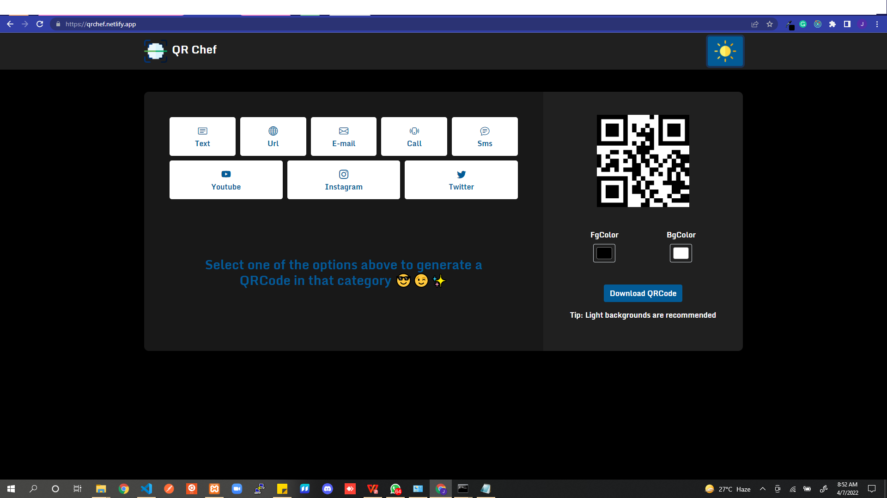

# QR Chef

This is a website that allows you to create dynamic and customizabe QRCodes.

## Main Features

<ul>
  <li>Generate different types of QR Codes (Text, Url, Sms, Call, Mail, Youtube, Twitter, Instagram)</li>
  <li>QR Codes can be customized (Change both fgColor and bgColor)</li>
  <li>QR Codes can be downloaded</li>
  <li>Light and Dark Mode</li>
</ul>

## Tools

<ul>
  <li>React</li>
  <li>Redux</li>
  <li>React Hooks (useState, useEffect, useSelector, useDispatch, useLocalStorage)</li>
  <li>Bootstrap</li>
</ul>

[The live site is available here](https://qrchef.netlify.app/).
